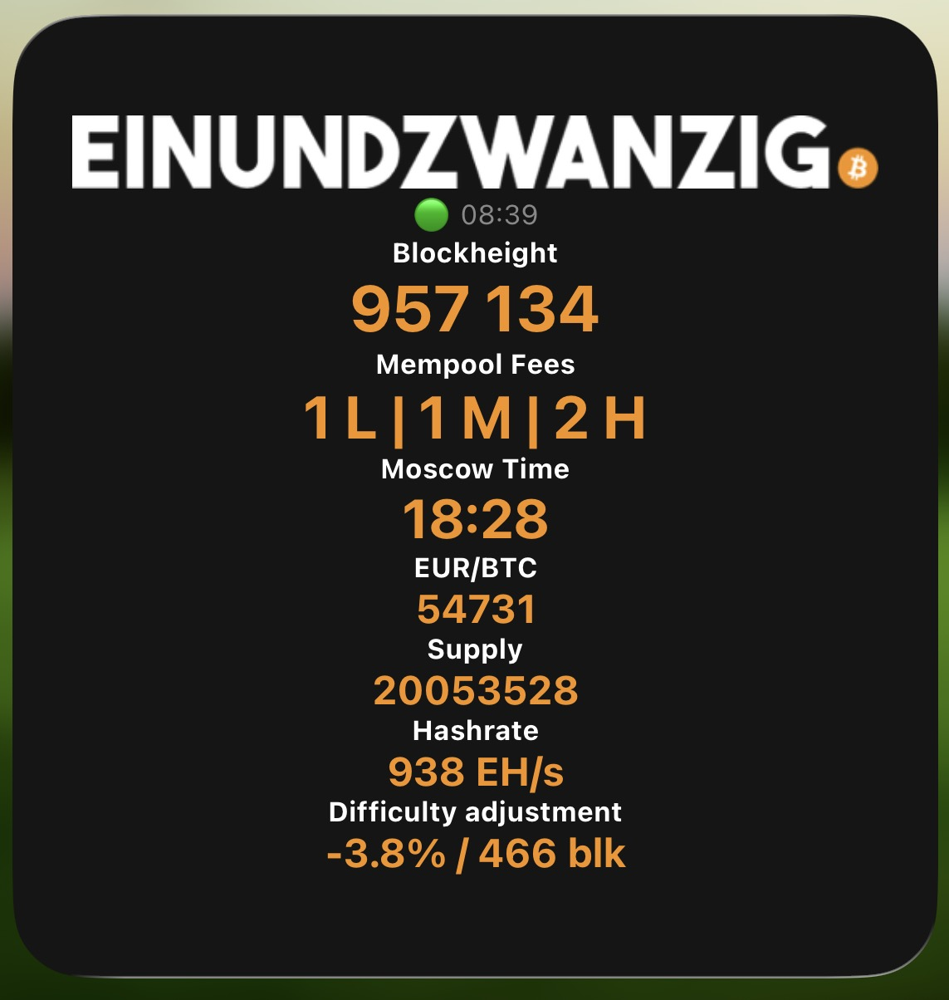
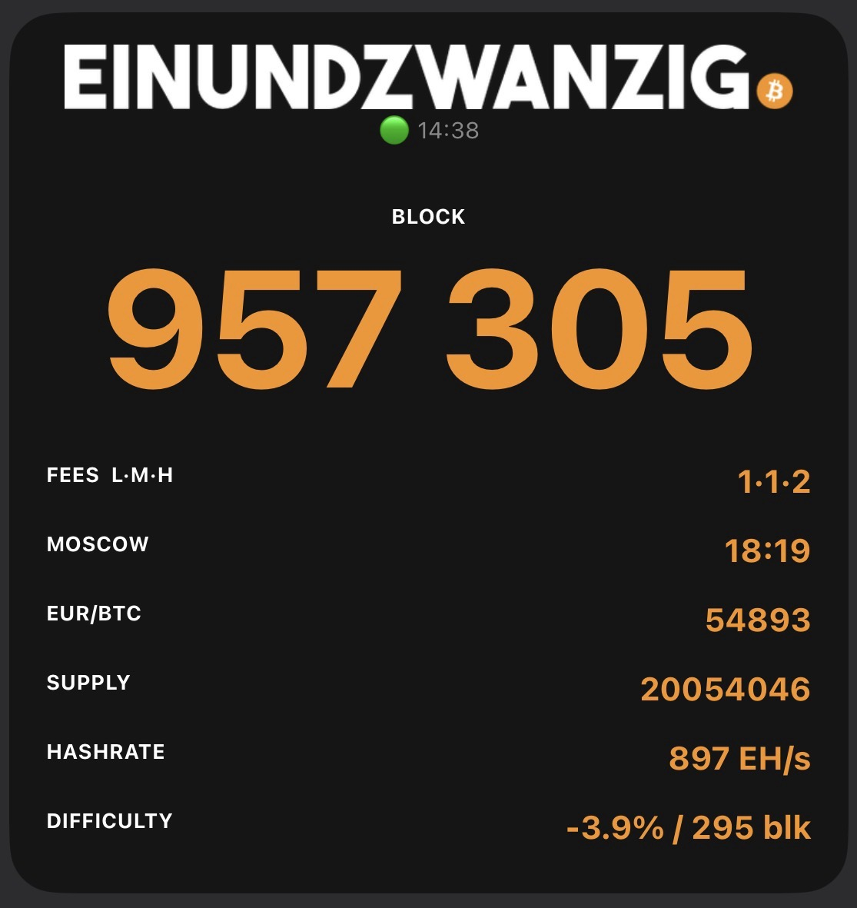

# Einundzwanzig Bitcoin Widget

A Bitcoin data widget for iOS built with [Scriptable](https://scriptable.app), originally created by [FlashmanBTC](https://twitter.com/FlashmanBTC) and maintained by the Einundzwanzig community. Enhanced with parallel requests, timeout handling, status indicators, and fallback URLs.

Displays live Bitcoin data directly on your iOS home screen: block height, mempool fees, Moscow Time, BTC price, circulating supply, hashrate, and difficulty adjustment.




---

## Features

- **Block Height** — current Bitcoin block height
- **Mempool Fees** — low / medium / high sat/vB fee estimates
- **Moscow Time** — satoshis per 1 unit of your chosen fiat currency
- **BTC Price** — current Bitcoin price in EUR, USD, or CHF
- **Circulating Supply** — mined BTC in whole coins
- **Hashrate** — current network hashrate in EH/s
- **Difficulty Adjustment** — expected change in % and remaining blocks

### Reliability

- All API requests run **in parallel** with individual timeouts — one slow API never blocks the others
- Every data source has a **fallback URL** that is tried automatically if the primary fails
- A **status indicator** (🟢 / 🟡 / 🔴) and timestamp show data freshness at a glance
- Failed values display `⚠️ n/a` in grey instead of crashing the widget

### Data Sources

| Data | Primary | Fallback |
|---|---|---|
| Block Height | mempool.space | blockstream.info |
| Fees | mempool.space | blockstream.info |
| Moscow Time | blockchain.info | calculated from price |
| BTC Price | mempool.space | blockchain.info |
| Supply | blockchain.info | — |
| Hashrate | mempool.space | mempool.blitzi.me |
| Difficulty | mempool.space | mempool.blitzi.me |

---

## Installation

First, install [Scriptable](https://apps.apple.com/app/scriptable/id1405459188) from the App Store.

### Method 1: One-Click Install (Recommended)

**Use this on your iPhone in Safari:**

[](https://raw.githubusercontent.com/orangedmind/einundzwanzig_widget/readme/einundzwanzig_v9.scriptable)

> **⚠️ Important:** This button only works in **Safari on iOS**. If you're on a Mac, iPad, or using Chrome/Firefox, use Method 2 below.

**How it works:**
1. Tap the badge above on your iPhone (in Safari)
2. Scriptable will open automatically and import the script
3. Go to your home screen, long-press, tap **+** and search for **Scriptable**
4. Add the large widget size and edit it to select the `Einundzwanzig` script

### Method 2: Manual import via GitHub

If the one-click install doesn't work:

1. Open this repository in **Safari on your iPhone**
2. Find the `einundzwanzig_v9.scriptable` file and tap it
3. Scriptable will open automatically and import the script
4. Go to your home screen, long-press, tap **+** and search for **Scriptable**
5. Add the large widget size and edit it to select the `Einundzwanzig` script

### Method 3: Manual copy-paste

For manual setup:

1. Open Scriptable and tap **+** in the top right corner
2. Paste the contents of `einundzwanzig_v9.js` into the editor
3. Tap the script name at the bottom and rename it to `Einundzwanzig`
4. Go to your home screen, long-press, tap **+** and search for **Scriptable**
5. Add the large widget size and edit it to select the `Einundzwanzig` script

---

## Configuration

All options are at the very top of the script — no need to read the rest of the code.

### Display Theme

```js
// Design theme: "classic" | "mono"
theme = "mono"
```

| Value | Description |
|---|---|
| `"mono"` | Monospace table style — logo and block height on top, data rows below with label left / value right |
| `"classic"` | Original centered layout — all values stacked vertically |

---

### Currency

```js
// Change currency EUR or USD or CHF
currency = "EUR"
```

Affects BTC price and Moscow Time. Supported values: `"EUR"`, `"USD"`, `"CHF"`.

---

### Fee Display Order

```js
// Change fee order — 1 = high to low, 0 = low to high
h_to_l = 0
```

| Value | Display |
|---|---|
| `0` | `1 L · 1 M · 3 H` |
| `1` | `3 H · 1 M · 1 L` |

---

### Color Customization

All colors can be customized at the top of the script. Both themes pick them up automatically.

```js
const C_BG        = "#151515"   // widget background
const C_ACCENT    = "#F7931A"   // main value color (Bitcoin orange)
const C_LABEL     = "#FFFFFF"   // section / row labels
const C_DIM       = "#888888"   // status line, subtle text
const C_ERROR     = "#555555"   // value color when data unavailable
const C_DIVIDER   = "#2a2a2a"   // divider lines (mono theme)
```

---

### Visible Data Sections

Each section can be toggled independently with `1` (on) or `0` (off).

```js
show_block  = 1   // Block height
show_fees   = 1   // Mempool fees
show_moscow = 1   // Moscow Time (sats per fiat unit)
show_price  = 1   // BTC price
show_supply = 1   // Circulating supply
show_hash   = 1   // Network hashrate
show_diff   = 1   // Difficulty adjustment
```

> **Note for `classic` theme:** The widget fits up to 5 active sections comfortably. With 6 or 7 active sections the font sizes scale down automatically to fit. The `mono` theme handles all 7 sections well.

---

### Font Scaling (small screens)

```js
// Scale  0 = iPhone 11 Pro / 13 Pro Max
// Scale -4 = iPhone SE 2020
scale = 0
```

Decrease this value (e.g. `-2`, `-4`) if you have a smaller device and text gets cut off.

---

### Request Timeout

```js
// Timeout per request in seconds
const TIMEOUT_SEC = 6
```

If an API does not respond within this time, the fallback URL is tried. Increase this value if you are on a slow connection, decrease it if you want faster failover.